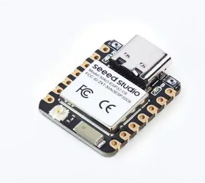
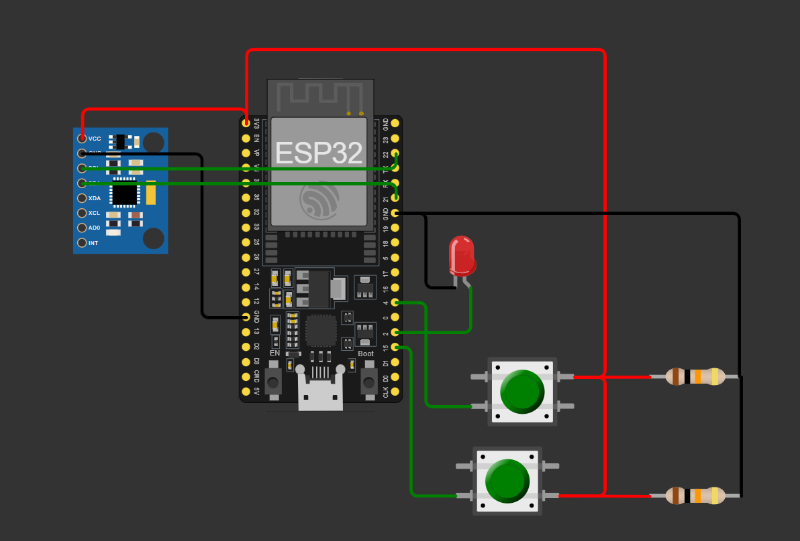
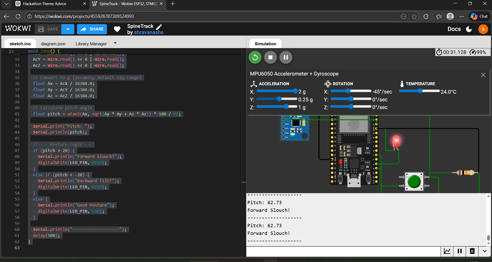

# Spine Track: Smart Posture & Exercise Monitoring System

## Problem Statement

In the modern digital era, prolonged sitting and sedentary lifestyles have become common, especially among students, software professionals, and remote workers. Studies and health reports indicate that extended hours of poor sitting posture lead to musculoskeletal disorders, chronic back pain, spinal misalignment, and long-term cervical and thoracic complications. Forward slouching posture, commonly referred to as "tech neck," is one of the most prevalent issues caused by continuous use of computers and smartphones.

**What Is Tech Neck?**
Even small forward tilts significantly increase spinal loading. This highlights the need for early detection before posture degradation progresses into severe cervical stress conditions.

Traditional posture correction methods rely on manual awareness, physical braces, or periodic medical consultations. However, these lack real-time feedback. Affordable wearables focus on step counting, leaving a gap for specialized upper-body tracking.

Additionally, bodyweight exercises like push-ups require proper spinal alignment to prevent injury.

**Therefore, there exists a need for a:**
*   Low-cost wearable system
*   Capable of real-time upper-body orientation tracking
*   Able to detect sustained forward slouching
*   Adaptable to different users through calibration
*   Extendable to basic exercise motion detection

This project addresses these challenges by designing a compact embedded system, **Spine Track**, that monitors spinal tilt using an IMU sensor and provides posture correction alerts while also supporting exercise motion analysis.

## Proposed Solution Overview

**Spine Track** is a wearable embedded system designed to monitor spinal tilt and detect exercise motion in real time. It is built around an **ESP32 microcontroller** and an **MPU6050 Inertial Measurement Unit (IMU)** sensor.

The system operates in two primary modes:

### 1. Posture Monitoring Mode
Monitors forward spinal tilt by calculating the pitch angle of the upper body. A long-press calibration mechanism allows the user to define a neutral posture reference. If the detected tilt deviates beyond a predefined threshold (20°) for more than five seconds, the system triggers an alert.

### 2. Exercise Monitoring Mode
Tracks body orientation changes to detect movement patterns such as push-ups. A state-machine-based algorithm ensures accurate repetition counting by detecting complete motion cycles (downward and upward transitions).

The firmware architecture allows for future enhancements such as additional exercises, OLED display, haptic feedback, and cloud logging via MQTT.

## System Architecture

Spine Track follows a centralized embedded architecture with four primary functional blocks:

1.  **Sensor Acquisition Block**: MPU6050 measures acceleration (X, Y, Z). ESP32 reads raw data via I2C and converts it to physical units.
2.  **Orientation Processing Block**: Calculates pitch angle using trigonometric relationships to determine torso tilt relative to gravity.
3.  **Control & Mode Management Block**:
    *   **Calibration Button (Long Press – 1s)**: Stores current posture as reference.
    *   **Mode Button**: Switches between Posture and Exercise modes.

4.  **Feedback & Alert Block**: LED indicator (or buzzer) provides real-time feedback for posture alerts and valid exercise repetitions.

## Hardware Configuration & Wiring

### Pin Connections

| Component | Pin | ESP32 Pin | Description |
| :--- | :--- | :--- | :--- |
| **MPU6050** | VCC | 3.3V / 5V | Power Supply |
| | GND | GND | Ground |
| | SDA | GPIO 21 | I2C Data |
| | SCL | GPIO 22 | I2C Clock |
| **Push Button** | Terminal 1 | GPIO 4 | Input (Active HIGH) |
| | Terminal 2 | 3.3V | Logic High Level |
| | Resistor | GND to GPIO 4 | **10kΩ Pull-Down** |
| **LED** | Anode (+) | GPIO 2 | Status Indicator |
| | Cathode (-) | GND | Ground (via 220Ω Resistor) |

### Pull-Down Resistor Logic
The push button is connected in an **Active HIGH** configuration.
*   **When Released:** The **10kΩ pull-down resistor** connects the GPIO pin to Ground (LOW, 0V). This ensures the pin doesn't "float" and randomly trigger due to electrical noise.
*   **When Pressed:** The button connects the GPIO pin directly to 3.3V (HIGH). This strong signal overrides the weak pull-down resistor, registering a valid input.

## Sensor Placement & Axis Mapping

The MPU6050 IMU sensor is mounted on the upper back, centrally between the shoulder blades.

**Axis Orientation Relative to the Body:**
*   **Y-axis**: Directed vertically toward the head (gravity aligned when standing).
*   **X-axis**: Directed horizontally from left shoulder to right shoulder.
*   **Z-axis**: Directed outward from the back (gravity aligned w/ Z in plank/push-up).

**Gravity Behavior:**
*   **Standing Upright**: Gravity aligns with Y-axis.
*   **Forward Slouching**: Gravity shifts toward X-axis. Pitch angle deviates positively.
*   **Push-up (Plank)**: Torso nearly horizontal. Gravity shifts to Z-axis.

## Orientation Calculation & Angle Computation

### Raw Data & Gravity Reference
The MPU6050 provides raw acceleration values (Ax, Ay, Az). Since the sensor is in ±2g mode, values are normalized by dividing by 16384. Gravity acts as a natural reference vector pointing downward.

### Pitch Angle Calculation
Pitch is calculated as:
`Pitch = atan2( Ax , sqrt( Ay*Ay + Az*Az ) ) * (180 / PI)`

### Deviation from Calibrated Reference
Instead of absolute angles, the system uses deviation:
`Deviation = CurrentPitch - ReferencePitch`
If `Deviation > 20 degrees` for > 5 seconds, a posture alert is triggered. This ensures personalization and compensates for mounting differences.

## Features & Implementation

### Calibration Mechanism
*   **Long-Press Logic**: Press Button 1 for 1 second to store the current pitch as `ReferencePitch`.
*   **Benefits**: Adapts to different users and mounting positions. Essential for accurate relative monitoring.

### Posture Detection Algorithm
*   **Objective**: Identify sustained forward slouching, ignoring short movements.
*   **Logic**:
    1.  Read accelerometer & compute pitch.
    2.  Check if `Deviation > 20 degrees`.
    3.  Start timer. If deviation lasts > 5 seconds -> **Trigger Alert**.
    4.  If posture corrects < 5 seconds -> **Reset Timer**.

### Exercise Detection Algorithm (Push-Ups)
*   **Objective**: Count valid repetitions using torso orientation.
*   **State Machine**:
    *   **State 0 (UP)**: Initial state.
    *   **State 1 (DOWN)**: Transition when `pitch < LowerThreshold` (e.g., Reference - 60°).
    *   **Count Rep**: Transition back to UP when `pitch > UpperThreshold` (e.g., Reference - 30°) AND current state is DOWN.
*   **Feedback**: LED blinks on valid count.

## Code Explanation

The firmware is written in C++ using the Arduino framework. You can find the full code here: [SpineTrack.ino](Code/SpineTrack/SpineTrack.ino)

### 1. Initialization (`setup()`)
*   Initializes Serial communication for debugging.
*   Initializes I2C communication with `Wire.begin()`.
*   Configures the **MPU6050** by waking it up from sleep mode.
*   Sets pin modes for the LED (Output) and Calibration Button (Input).

### 2. Data Acquisition & Processing
*   The system communicates with the MPU6050 via I2C to read raw accelerometer data (Ax, Ay, Az).
*   **Pitch Calculation**: The raw values are converted to a pitch angle using the formula:
    `pitch = atan2(Ax, sqrt(Ay*Ay + Az*Az)) * 180 / PI`

### 3. Calibration Logic
*   When the button (GPIO 4) is pressed:
    *   The current pitch is stored as `referencePitch`.
    *   The system sets `calibrated = true` to begin monitoring.
    *   This "zeros" the system to the user's current comfortable posture.

### 4. Slouch Detection Logic (`loop()`)
*   The code continuously checks the **deviation**: `pitch - referencePitch`.
*   If `deviation > 20 degrees`:
    *   A timer (`slouchStartTime`) starts.
    *   If the condition persists for > 5 seconds, the LED turns ON (Alert).
*   If the user corrects their posture (deviation < 20°):
    *   The timer resets.
    *   The LED turns OFF.

## Simulation & Testing

The system was validated using the Wokwi simulation environment before hardware integration.

*   **Simulation Link 1**: [Wokwi Project 1](https://wokwi.com/projects/455928787309524993)
*   **Simulation Link 2**: [Wokwi Project 2](https://wokwi.com/projects/455996891569295361)

## Schematic & Test Results

*(This section will be updated with circuit schematics and real-world test data images)*

### PCB Design
We are currently designing a custom PCB for SpineTrack to make it a compact wearable.
*   **Status**: In Progress
*   **Files**: Gerber, BOM, and Pick & Place files will be uploaded here once completed.
*   **Folder**: `PCB_Files/` (Coming Soon)

## Future Scope

*   **OLED Display**: Real-time angle and rep count.
*   **Haptic Feedback**: Vibration alerts for silent correction.
*   **Cloud Logging**: MQTT-based checking for long-term analytics.
*   **Enhanced Calibration**: Machine learning for better motion classification.
*   **Custom PCB**: Miniaturized wearable form factor.

---
*Generated based on project specifications.*
